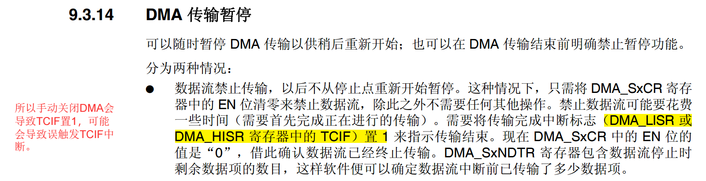
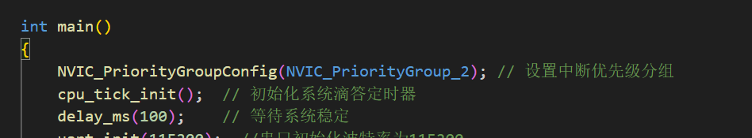
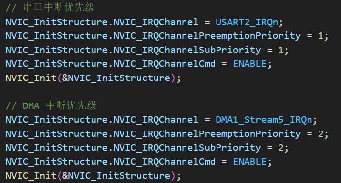
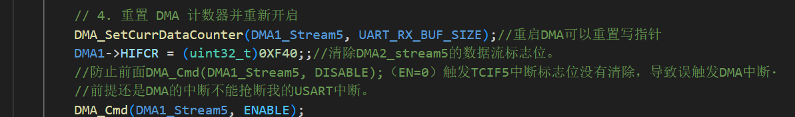
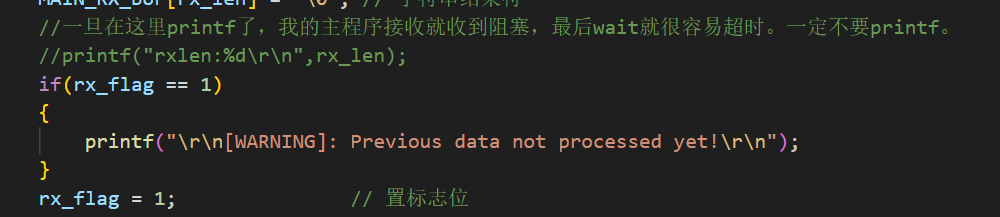
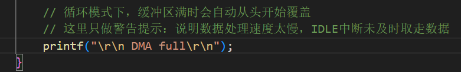

# 12.25日版本，文件：usart2_dma_at.c   与esp_at.c 编程笔记

---

## dma与usart中断：

代码开启了两个中断，分别为：USART_IT_IDLE，DMA_IT_TC；

理想的实现是USART_IT_IDLE中断负责处理每一帧数据，将数据拷贝到主程序缓冲区，修改rx_len 和rx_flag;

因为理想情况下，DMA永远不会达到TC中断，一旦达到，DMA_IT_TC中断中打印缓冲区溢出，方便我调试。

注意点：

在idle处理中断中，因为要进行数据拷贝所以需要关闭DMA，

```c
        // 1. 停止 DMA 传输
        DMA_Cmd(DMA1_Stream5, DISABLE);//防止数据拷贝过程中有新数据进来，虽然概率很小
        while(DMA_GetCmdStatus(DMA1_Stream5) != DISABLE); // 等待停止
```


但是关闭DMA（EN = 0）会导致TCIF置1



但此时缓冲区并没有溢出，我们不想调用TCIF中断，为了实现不进入TCIF中断，需要实现：

1. **TCIF中断不能在IDLE中断中嵌套；**

   首先看分组：

   

   如果用户不手动分组，默认分组是0，没有抢占优先级，不会嵌套，所以就可以满足条件，但这样不稳妥

   更重要是要给两个中断优先级设置：

   

   确保无论分组如何,TCIF中断不能嵌套IDLE中断。

2. **在退出IDLE中断时一定要开启DMA，在开启DMA前一定要清除TCIF标志位；**

   在idle中断中对数据处理完毕后，就可以开启dma了：

   

   一定清理我的标志位，这一点在参考手册也有：

   

满足这两个条件就可以实现两个中断的预期功能；

---

## 中断中不要printf：

我的中断中只有在错误情况下有printf：





正常工作的代码中，千万不要加printf，尤其对于本代码：

代码中果CPU处理缓冲区的速度太慢，下一帧数据传输完毕，idle中断中就会更新主程序缓冲区，如果此时还没有处理好上一帧，那么就会出现数据丢失，所以我在程序中，每一次发送命令后一定紧接着waitresponse，附带超时时间，

如果我们在中断中加了prinf，中断中时间太长，很容易出现莫名其妙的情况，所以对于对时序要求严格的程序，不要加printf在中断。

就算为了调试内容，printf一定要简短，同时尽量在外面打印调试。

---

## 待更新功能：

DMA可以用双缓冲，这样在idle中断中不需要进行数据拷贝，能更快跳出中断，避免错误。

